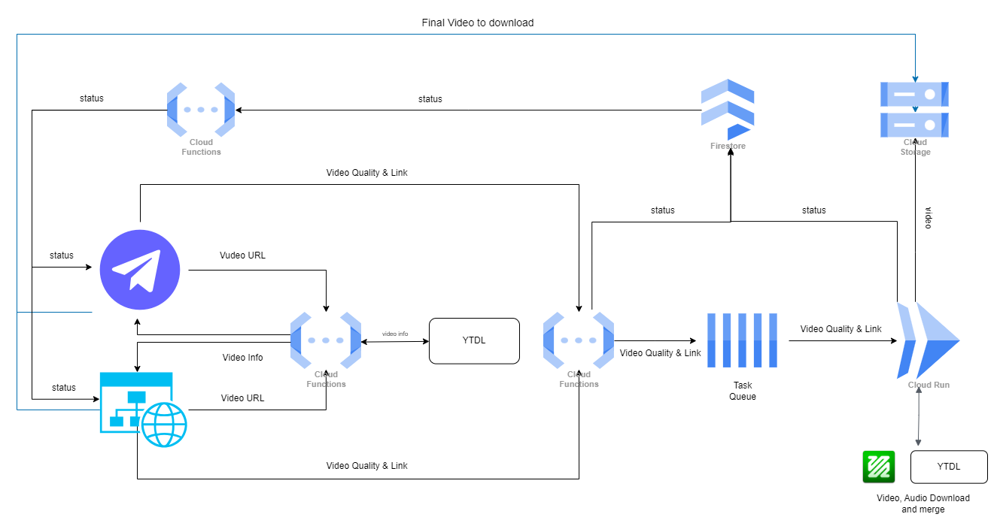

Hi I have made a project on downloading videos from youtube in every quality with audio on both web and telegram Platform

## How to access the project

[website](https://ovd.pixismith.com/)
[Telegram Bot](https://t.me/onlineVideoDownloaderBot)

## All the repos are in the following links

[Web Frontend](https://github.com/SBRakeshRath/ovd-web-frontend)
[web Backend](https://github.com/SBRakeshRath/ovd-web-backend)
[Telegram Bot](https://github.com/SBRakeshRath/ovd-bot-webhook)
[Video Handling Server](https://github.com/SBRakeshRath/ovd-video-handeling-server)
[Store Database Update Handler](https://github.com/SBRakeshRath/ovd-storage-db-update)

## Purpose of Making this Project

I live in a low network area with terrible data speed on daytime. So, when I wanted to follow some tutorial to learn new things from youtube my one third of the time was getting wasted in buffering for which I was getting frustrated. I tried to search for different solutions and I found I can save tutorials on youtube but I use multiple devise so I have to save it on multiple device which is again annoying (Imagine I am carrying a laptop to public place to download a youtube video). So there are 3rd party solutions also like vidmate apk but they have to be installed on my android phone and often the app has some issue or the downloaded video get corrupted easily and there is a threat to the phone always as these apps are un regulated. The websites which are present for this support only provide limited quality to download as the youtube separately stores the audio and video for most of the higher quality.

## Project (Technical Details)

### System Architect

The system is made completely on GCP and firebase.

### Tech stack

- React
- Telegraf js
- Typescript
- Express
- GCP

## Contribution

Please Feel free to contribute
